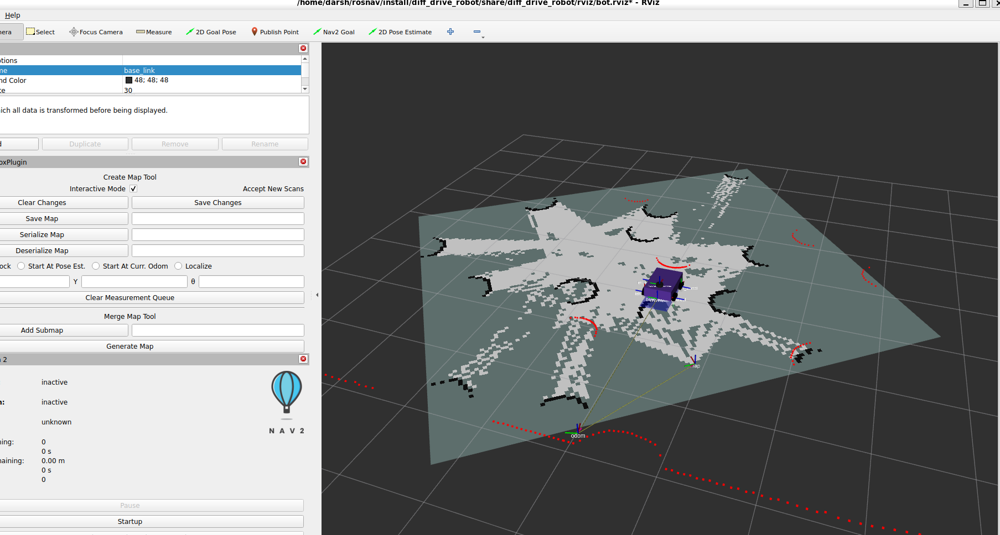

# ROS 2 Navigation and SLAM with Nav2 and Gazebo Harmonic

Autonomous differential-drive robot navigation with live SLAM mapping, frontier-based exploration, and multi-robot coordination — built on **ROS 2 Jazzy**, **Nav2**, **SLAM Toolbox**, and **Gazebo Harmonic**.




---

## Table of Contents

1. [Architecture & algorithms](#architecture--algorithms)
2. [Features](#features)
3. [Requirements](#requirements)
4. [Installation](#installation)
5. [Quick start: interactive launcher](#quick-start-interactive-launcher)
6. [Manual launch (explicit control)](#manual-launch-explicit-control)
7. [Driving the robot](#driving-the-robot)
8. [Saving and reusing maps](#saving-and-reusing-maps)
9. [Multi-robot operation](#multi-robot-operation)
10. [Worlds](#worlds)
11. [Configuration reference](#configuration-reference)
12. [Repo organization](#repo-organization)
13. [Running from Windows (WSL2)](#running-from-windows-wsl2)
14. [Troubleshooting](#troubleshooting)

---

## Architecture & algorithms

The stack is a **three-tier autonomy architecture**:

```
┌─────────────────────────────────────────────────────────────────────┐
│  Mission Layer       — mission_server.py                            │
│                        High-level goals (patrol / sequence / goto)  │
├─────────────────────────────────────────────────────────────────────┤
│  Navigation Layer    — Nav2: planner + controller + behavior tree   │
│                        Path planning, local control, recovery       │
├─────────────────────────────────────────────────────────────────────┤
│  Sensing & Mapping   — SLAM Toolbox + costmaps                      │
│                        Live mapping, obstacle inflation, footprint  │
└─────────────────────────────────────────────────────────────────────┘
              ▲                                              │
              │ /scan, /odom, /tf                            │ /cmd_vel
              │                                              ▼
                            Gazebo Harmonic
                       (differential-drive robot + 2D LiDAR)
```

### Algorithms

| Layer | Algorithm | Source | Where it's used |
|---|---|---|---|
| **SLAM** | Pose-graph SLAM with Ceres solver (SCHUR_JACOBI preconditioner) | `slam_toolbox` library | Live mapping during `slam_nav.launch.py` |
| **Localization** | AMCL — Adaptive Monte Carlo Localization (particle filter) | `nav2_amcl` | Pre-built-map mode via `robot.launch.py` |
| **Global planning** | Smac Hybrid-A* with Reeds-Shepp motion model | `nav2_smac_planner` | All Nav2 goals — kinematically-feasible paths |
| **Local control** | MPPI — Model Predictive Path Integral (sample-based stochastic controller) | `nav2_mppi_controller` | Following the global path while avoiding local obstacles |
| **Behavior orchestration** | Custom Behavior Tree (XML) with backup→spin→clear→wait recovery | `nav2_behavior_tree` | `config/bt/navigate_w_recovery.xml` |
| **Frontier exploration** | Connected-component frontier clustering + nearest-centroid goal selection (BFS implementation, NumPy only — no SciPy) | Custom: `scripts/frontier_explorer.py` | Single-robot `explore:=true` |
| **Multi-robot frontier coordination** | Centralized frontier assignment — one unique frontier per idle robot | Custom: `scripts/frontier_coordinator.py` | Multi-robot `explore:=true` |
| **Multi-robot task allocation** | Hungarian algorithm on robot↔task distance matrix | Custom: `scripts/task_allocator.py` | `multi_robot.launch.py fleet_mgmt:=true` |
| **Coverage planning** | Boustrophedon (lawnmower) sweep over eroded free space | Custom: `scripts/coverage_planner.py` | Standalone post-mapping |
| **Dynamic obstacle tracking** | Frame-to-frame range deltas + single-linkage clustering | Custom: `scripts/obstacle_tracker.py` | Standalone |
| **Velocity smoothing** | Jerk-limited velocity (acceleration + deceleration bounds) | `nav2_velocity_smoother` | `/cmd_vel` → `/cmd_vel_smoothed` automatically |
| **Collision safety** | Polygon-based stop/slowdown zones from costmap footprint | `nav2_collision_monitor` | Auto-enabled in Nav2 stack |

### Educational standalone implementations

Two scripts implement the core ideas from scratch (no library), useful for understanding what Nav2 does under the hood:

- `scripts/path_planning.py` — **A\*** on a discrete grid with 8-connectivity and Euclidean heuristic
- `scripts/navigation.py` — **4-state FSM** for reactive obstacle avoidance: `GOAL_SEEK → FIND_CLEAR → MOVE_CLEAR → REALIGN`

These don't drive the main Nav2 pipeline; they're educational references.

---

## Features

- **SLAM live mapping** — SLAM Toolbox builds the map while you drive (or autonomously)
- **Frontier-based autonomous exploration** — single robot or coordinated multi-robot
- **Full Nav2 stack** — Smac Hybrid-A* planner, MPPI controller, custom behavior tree
- **Multi-robot fleet** — N robots sharing one SLAM map, namespaced TF, scalable
- **Coordinated exploration** — central coordinator assigns each robot a unique frontier
- **Fleet management** (optional) — mission server, Hungarian task allocator, health monitor, deadlock recovery, priority collision avoidance
- **Waypoint following** — execute a sequence of poses through Nav2's FollowWaypoints
- **Coverage planning** — boustrophedon sweep over free space
- **Custom behavior tree** — `backup → spin → clear costmaps → wait` recovery sequence
- **2D LiDAR** — native `LaserScan` over `/scan`; 3D LiDAR (`PointCloud2`) optional via `pointcloud_to_laserscan`
- **Self-contained maze world** — pure SDF, no asset downloads
- **Velocity smoother** — jerk-limited `/cmd_vel` pipeline
- **Fleet GUI** — Tkinter dashboard for click-to-navigate
- **Fleet CLI** — `fleet_manager.py` for list/status/goto/teleop/savemap/mission/tasks
- **Dynamic obstacle tracker** — detects and tracks moving obstacles from consecutive scans

---

## Requirements

| Component | Version |
|---|---|
| ROS 2 | **Jazzy** |
| OS | Ubuntu 24.04 |
| Gazebo | **Harmonic** (`gz sim 8.x`) |

(Windows 11 users: see [Running from Windows (WSL2)](#running-from-windows-wsl2).)

---

## Installation

```bash
sudo apt install -y \
  ros-jazzy-ros-gz ros-jazzy-ros-gz-bridge \
  ros-jazzy-xacro ros-jazzy-joint-state-publisher \
  ros-jazzy-nav2-bringup ros-jazzy-slam-toolbox \
  ros-jazzy-navigation2 ros-jazzy-teleop-twist-keyboard \
  ros-jazzy-nav2-smac-planner

mkdir -p ~/rosnav/src && cd ~/rosnav/src
git clone https://github.com/Etsubdink-Zebre/ros-nav-implementation.git
cd ~/rosnav
colcon build --symlink-install
source ~/rosnav/install/setup.bash
```

Add `source ~/rosnav/install/setup.bash` to your `~/.bashrc` if you don't want to re-source every shell.

---

## Quick start: interactive launcher

The simplest way to run the stack — a wrapper script at the repo root asks two questions:

```bash
cd ~/rosnav/src/ros-nav-implementation
./run.sh
```

**Windows users**: run this from a **Windows Terminal → Ubuntu tab**, not from `cmd.exe`. (Press Win, type *Terminal*, click ▼ → Ubuntu.) Plain `cmd.exe` can't execute `.sh` scripts directly. See [Running from Windows (WSL2)](#running-from-windows-wsl2) for the full setup.

```
=== rosnav launcher ===
World: maze (the only world)

Fleet size?
  [1] Single robot
  [2] Multi robot
Choice [1-2]: _

Control mode?
  [1] Automatic (frontier exploration)
  [2] Manual (drive with keyboard)
Choice [1-2]: _

Launching: ros2 launch diff_drive_robot ...
```

- **Automatic mode** — the robot starts driving itself once the stack is ready (single: `frontier_explorer.py`; multi: 10-second SLAM bootstrap spin → `frontier_coordinator.py` assigns frontiers).
- **Manual mode** — a **second Windows Terminal tab opens automatically** running `teleop.sh`, which waits for the sim to be ready and then starts `teleop_twist_keyboard`. Click into that tab and use `i / j / k / l / ,` to drive. (Falls back to a printed instruction if `wt.exe` isn't available — e.g. you're not in Windows Terminal.)

After ~90 seconds (single robot) or ~3-5 minutes (multi-robot) for first-launch heuristic table builds, you should see:
```
[lifecycle_manager-NN] Managed nodes are active
[lifecycle_manager-NN] Creating bond timer...
```

For headless mode, fleet management, or scripted use, invoke `ros2 launch ...` directly — see the per-tab sections below.

---

## Manual launch (explicit control)

### Single robot: SLAM + Nav2 + Gazebo + RViz

```bash
# Manual control (you drive)
ros2 launch diff_drive_robot slam_nav.launch.py world_name:=maze rviz:=True

# Automatic frontier exploration
ros2 launch diff_drive_robot slam_nav.launch.py world_name:=maze explore:=true

# Custom spawn pose (avoid walls)
ros2 launch diff_drive_robot slam_nav.launch.py world_name:=maze \
  spawn_x:=2.0 spawn_y:=2.0 spawn_z:=0.3 spawn_yaw:=0.0
```

**Single-robot launch arguments:**

| Argument | Default | Description |
|---|---|---|
| `world_name` | `maze` | World name from `worlds/` (only `maze` is currently included) |
| `world` | *(auto)* | Full path to a custom `.world` file |
| `explore` | `false` | `true` = auto-start frontier exploration with periodic map saving |
| `rviz` | `True` | Launch RViz |
| `robot_name` | `diff_drive` | Gazebo entity name |
| `spawn_x` / `spawn_y` / `spawn_z` / `spawn_yaw` | `1.5` / `1.0` / `0.3` / `0.0` | Initial pose |
| `map_prefix` | *(auto)* | Override the map save path; default is `share/diff_drive_robot/maps/map_<world_name>` |

### Multi-robot: 3 robots, shared SLAM map, coordinated exploration

```bash
# SLAM + coordinated exploration (default — 3 robots, maze world)
ros2 launch diff_drive_robot multi_robot.launch.py

# Pre-built map mode (no exploration; use after saving a map)
ros2 launch diff_drive_robot multi_robot.launch.py explore:=false

# Headless (no GUI — CI / SSH-friendly)
ros2 launch diff_drive_robot multi_robot.launch.py headless:=true

# With full fleet management layer
ros2 launch diff_drive_robot multi_robot.launch.py fleet_mgmt:=true
```

**Multi-robot launch arguments:**

| Argument | Default | Description |
|---|---|---|
| `world` | `maze` | World name or full `.world` path |
| `explore` | `true` | `true` = SLAM + frontier exploration; `false` = pre-built map + AMCL |
| `headless` | `false` | `true` = Gazebo server only — no GUI, no RViz |
| `fleet_mgmt` | `false` | `true` = also start mission server, task allocator, fleet health, priority collision avoidance, deadlock recovery |
| `rviz` | `True` | `false` = skip RViz (auto-skipped when `headless:=true`) |
| `map` | *(auto)* | Path to pre-built map yaml; used when `explore:=false` |

### Pre-built map mode (no SLAM)

After you've saved a map (see below):

```bash
# Default world from saved map
ros2 launch diff_drive_robot robot.launch.py world:=/full/path/to/maze.world

# Force a specific map file
ros2 launch diff_drive_robot robot.launch.py map:=/full/path/to/my_custom_map.yaml
```

This loads `map_<world>.yaml`, brings up AMCL for localization, and skips SLAM. Use **2D Pose Estimate** in RViz to set the initial pose, then send goals as usual.

---

## Driving the robot

### Teleop (keyboard control)

In a **separate terminal**:

```bash
source /opt/ros/jazzy/setup.bash
ros2 run teleop_twist_keyboard teleop_twist_keyboard
```

Click into the terminal to give it focus, then:

| Key | Action |
|---|---|
| `i` / `,` | Forward / backward |
| `j` / `l` | Rotate left / rotate right |
| `u` / `o` | Forward + curve left/right |
| `m` / `.` | Backward + curve left/right |
| `k` | Stop |
| `q` / `z` | Increase / decrease overall speed |
| `Ctrl+C` | Quit |

The `currently: speed 0.50 turn 1.00` line stays unchanged when you press direction keys — only `q / z / w / x / e / c` (speed adjustments) update it. The direction keys silently publish to `/cmd_vel`.

**Multi-robot teleop:**

```bash
# Drive only robot1
ros2 run teleop_twist_keyboard teleop_twist_keyboard --ros-args -r cmd_vel:=/robot1/cmd_vel

# Interactive multi-robot switcher (built-in script)
ros2 run diff_drive_robot multi_teleop.py
```

### Send a Nav2 goal in RViz

1. In RViz, click the **2D Goal Pose** button at the top
2. Click+drag on the map to set position + heading
3. Nav2 plans a path (visible as `/plan`) and the robot drives there

For multi-robot, remap the action topic in RViz's "2D Goal Pose" tool properties to e.g. `/robot1/navigate_to_pose`.

### Send a Nav2 goal from CLI

```bash
ros2 action send_goal /navigate_to_pose nav2_msgs/action/NavigateToPose \
  "{pose: {header: {frame_id: map}, pose: {position: {x: 3.0, y: 1.0}, orientation: {w: 1.0}}}}"

# Multi-robot: replace /navigate_to_pose with /robot1/navigate_to_pose
ros2 action send_goal /robot1/navigate_to_pose nav2_msgs/action/NavigateToPose \
  "{pose: {header: {frame_id: map}, pose: {position: {x: -1.5, y: -0.5}, orientation: {w: 1.0}}}}"
```

### Fleet CLI (multi-robot management)

```bash
ros2 run diff_drive_robot fleet_manager.py list                # discover active robots
ros2 run diff_drive_robot fleet_manager.py status              # SLAM/Nav2/map health
ros2 run diff_drive_robot fleet_manager.py goto robot1 3.0 -1.0
ros2 run diff_drive_robot fleet_manager.py teleop robot1
ros2 run diff_drive_robot fleet_manager.py explore robot2
ros2 run diff_drive_robot fleet_manager.py savemap src/diff_drive_robot-main/maps/map_maze
ros2 run diff_drive_robot fleet_manager.py mission robot1 patrol 1,2,0 3,4,90 0,0,180
ros2 run diff_drive_robot fleet_manager.py tasks add 2.0 1.5 0 pickup_A
ros2 run diff_drive_robot fleet_manager.py tasks status
ros2 run diff_drive_robot fleet_manager.py health
```

### Fleet GUI (graphical)

```bash
ros2 run diff_drive_robot fleet_gui.py
```

Tkinter dashboard: live robot list, click on map to send goals, velocity sliders, spawn/save.

---

## Saving and reusing maps

After exploring with SLAM, save the map for future AMCL navigation:

```bash
ros2 run nav2_map_server map_saver_cli -f ~/rosnav/src/diff_drive_robot-main/maps/map_maze
```

This writes:
- `map_maze.pgm` — grayscale occupancy image
- `map_maze.yaml` — metadata (resolution, origin, thresholds)

After saving, load it for pure-localization navigation (no SLAM):

```bash
ros2 launch diff_drive_robot robot.launch.py world:=/full/path/to/maze.world
```

The launch auto-locates `map_maze.yaml` from `share/diff_drive_robot/maps/` based on the world name.

Maps are gitignored — they're per-run artifacts.

---

## Multi-robot operation

### Adding more robots

Edit the `ROBOTS` list at the top of [`launch/multi_robot.launch.py`](src/diff_drive_robot-main/launch/multi_robot.launch.py):

```python
ROBOTS = [
    {'name': 'robot1', 'x': '-2.0', 'y': '-1.0', 'z': '0.3', 'yaw': '0.0'},
    {'name': 'robot2', 'x': '-0.8', 'y': '-1.0', 'z': '0.3', 'yaw': '0.0'},
    {'name': 'robot3', 'x':  '0.5', 'y': '-1.0', 'z': '0.3', 'yaw': '0.0'},
    # add robot4, robot5, ... as needed
]
```

The frontier coordinator and Nav2 stacks pick up the new entries automatically.

### TF namespacing

Each robot uses `frame_prefix: <namespace>/` in its `robot_state_publisher`, so TF frames are isolated:

```
robot1/base_link    robot1/odom    robot1/laser_frame
robot2/base_link    robot2/odom    robot2/laser_frame
...
```

The `map` frame is shared across all robots.

### Coordinated exploration

`frontier_coordinator.py` starts once at t=20 s (after all Nav2 stacks are up). On each poll cycle (every 2 s):

1. Reads `/map` and finds all frontier clusters
2. Assigns the nearest unassigned frontier to each idle robot
3. When a robot reaches its frontier, marks it done and assigns the next
4. If a robot fails to reach, frees the frontier for another robot to retry

No two robots ever target the same frontier.

### Fleet management layer

When `fleet_mgmt:=true`, the launch additionally starts:

| Node | Role |
|---|---|
| `mission_server.py` | Per-robot mission execution (`patrol`, `sequence`, `goto`) |
| `task_allocator.py` | Hungarian task assignment across idle robots |
| `fleet_health.py` | Per-robot odom/scan Hz, Nav2 presence, mission state |
| `priority_collision_avoidance.py` | Lower-priority robots yield in predicted conflicts |
| `deadlock_recovery.py` | Detects stuck robots and triggers recovery |

```bash
ros2 launch diff_drive_robot multi_robot.launch.py fleet_mgmt:=true
```

Note: this is **reactive** fleet coordination (per-robot Nav2 + priority yielding), **not** a centralized multi-agent planner like CBS.

### Sending missions

```bash
# Patrol loop — visit 3 waypoints repeatedly
ros2 run diff_drive_robot mission_server.py patrol robot1 1,2,0 3,4,90 0,0,180

# One-shot sequence
ros2 run diff_drive_robot mission_server.py sequence robot1 2,0,0 2,2,90 0,2,180

# Single goal
ros2 run diff_drive_robot mission_server.py goto robot1 3.0 -1.0 45

# Check state / cancel
ros2 run diff_drive_robot mission_server.py status
ros2 run diff_drive_robot mission_server.py cancel robot1
```

### Headless verification

```bash
ros2 topic list | grep -E "/robot1|/robot2|/robot3"
ros2 topic hz /map
ros2 action list | grep navigate_to_pose
ros2 action send_goal /robot1/navigate_to_pose nav2_msgs/action/NavigateToPose \
  "{pose: {header: {frame_id: map}, pose: {position: {x: 3.0, y: 1.0}, orientation: {w: 1.0}}}}"
ros2 topic echo /robot1/odom --once
```

### Extras

```bash
# Boustrophedon coverage sweep (single robot, after mapping)
ros2 run diff_drive_robot coverage_planner.py
ros2 run diff_drive_robot coverage_planner.py --ros-args -p sweep_spacing:=0.4

# Dynamic obstacle tracker
ros2 run diff_drive_robot obstacle_tracker.py
ros2 topic echo /obstacle_tracker/state

# Fleet health (live JSON dashboard)
ros2 topic echo /fleet/health
```

---

## Worlds

Currently only one world is included: `maze` — an enclosed maze, pure SDF (no external model downloads). To add more worlds, drop additional `.world` files into `src/diff_drive_robot-main/worlds/` and refer to them by `world_name:=<filename without .world>`.

---

## Configuration reference

Key config files in [`src/diff_drive_robot-main/config/`](src/diff_drive_robot-main/config/):

| File | Purpose |
|---|---|
| `nav2_params_jazzy.yaml` | Single-robot Nav2 stack params (planner, controller, costmaps, BT) |
| `nav2_multirobot_params_jazzy.yaml` | Template for multi-robot Nav2 params (`ROBOT_NS` placeholder substituted at launch) |
| `mapper_params_online_async.yaml` | SLAM Toolbox params for single-robot live mapping |
| `mapper_params_multirobot.yaml` | SLAM Toolbox params for the shared-map robot in multi-robot mode |
| `gz_bridge.yaml` | gz_bridge topic routing: Gazebo ↔ ROS 2 |
| `locations.yaml` | Named locations consumed by `mission_server` / `waypoint_nav` / `fleet_manager` |
| `bt/navigate_w_recovery.xml` | Custom Nav2 behavior tree (replaces default) |

### Key Nav2 parameters that affect navigation behavior

| Parameter | Where | Notable choices |
|---|---|---|
| `controller_server.FollowPath.plugin` | `nav2_params_jazzy.yaml` | `nav2_mppi_controller::MPPIController` |
| `controller_server.FollowPath.CostCritic.consider_footprint` | `nav2_params_jazzy.yaml` | `false` — uses `robot_radius` (0.22 m). Setting `true` requires explicit footprint polygon. |
| `planner_server.GridBased.plugin` | `nav2_params_jazzy.yaml` | `nav2_smac_planner::SmacPlannerHybrid` |
| `planner_server.GridBased.motion_model_for_search` | `nav2_params_jazzy.yaml` | `REEDS_SHEPP` |
| `bt_navigator.default_nav_to_pose_bt_xml` | `nav2_params_jazzy.yaml` | Points to `config/bt/navigate_w_recovery.xml` |
| `local_costmap.robot_radius` | `nav2_params_jazzy.yaml` | `0.22` m — must match `consider_footprint` choice |
| `global_costmap.inflation_layer.inflation_radius` | `nav2_params_jazzy.yaml` | `0.70` m — clearance from walls |

### Custom behavior tree

The custom BT at `config/bt/navigate_w_recovery.xml` retries the plan-and-follow pipeline up to 6 times, with a round-robin recovery sequence on each failure:

```
Retry up to 6 times:
  ├─ [Try] PipelineSequence: ComputePath → FollowPath (with replanning at 1 Hz)
  └─ [Recover] RoundRobin (rotates through on each failure):
       1. BackUp 0.20 m
       2. Spin 90°
       3. ClearBothCostmaps
       4. Wait 3 s
```

---

## Repo organization

```
.
├── README.md
├── concepts.md                       # Deep-dive reference for ROS 2 concepts
├── run.sh                            # Interactive launcher (single/multi + world + mode)
├── images/                           # README screenshots and GIFs
├── waypoints.yaml                    # Default waypoints for waypoint_nav.py
└── src/diff_drive_robot-main/
    ├── CMakeLists.txt                # Installs scripts + share dir
    ├── package.xml
    ├── launch/
    │   ├── slam_nav.launch.py        # Single-robot SLAM + Nav2 + Gazebo + RViz
    │   ├── slam.launch.py            # SLAM only (no Nav2)
    │   ├── robot.launch.py           # Pre-built map + AMCL + Nav2
    │   ├── multi_robot.launch.py     # N-robot fleet
    │   ├── nav2.launch.py            # Nav2 only (attach to running Gazebo)
    │   ├── nav2_navigation_global_tf.launch.py  # Per-namespace Nav2 stack (used by multi_robot)
    │   └── rsp.launch.py             # robot_state_publisher with frame_prefix support
    ├── urdf/
    │   ├── robot.urdf.xacro          # Top-level robot description
    │   ├── robot_core.xacro          # Chassis + wheels
    │   ├── gazebo_control.xacro      # Diff-drive plugin
    │   ├── lidar.xacro               # 2D LiDAR (default)
    │   ├── lidar3d.xacro             # 3D LiDAR (optional — swap into robot.urdf.xacro)
    │   └── camera.xacro              # RGB camera
    ├── worlds/                       # SDF world (maze)
    ├── config/                       # YAML + RViz configs (see Configuration reference above)
    ├── rviz/bot.rviz                 # RViz layout
    ├── maps/                         # SLAM map artifacts (.pgm, .yaml — gitignored)
    └── scripts/
        ├── frontier_explorer.py      # Single-robot frontier exploration
        ├── frontier_coordinator.py   # Multi-robot frontier assignment
        ├── mission_server.py         # Mission execution daemon
        ├── task_allocator.py         # Hungarian task allocation
        ├── coverage_planner.py       # Boustrophedon coverage sweep
        ├── obstacle_tracker.py       # Dynamic obstacle tracker
        ├── collision_monitor.py      # Standalone Python safety watchdog (optional)
        ├── fleet_manager.py          # Fleet CLI
        ├── fleet_gui.py              # Fleet GUI (Tkinter)
        ├── fleet_health.py           # Fleet health monitor
        ├── multi_teleop.py           # Interactive multi-robot teleop
        ├── priority_collision_avoidance.py
        ├── deadlock_recovery.py
        ├── waypoint_nav.py           # Sequence-of-poses navigation via FollowWaypoints
        ├── navigation.py             # Educational: 4-state FSM obstacle avoidance (no Nav2)
        ├── path_planning.py          # Educational: standalone A* implementation
        ├── check_odometry.py         # Debug script
        └── reset_pose.py             # Reset robot pose in simulation
```

---

## Running from Windows (WSL2)

If you're on Windows 11 and want to **edit the code in VSCode on Windows but run ROS inside WSL2**, point a WSL workspace at the Windows source via a symlink. Edits in VSCode are then live for `ros2 launch` — no copying, no rebuild for `.py` / `.yaml` / `.xml` / `.xacro` changes.

### One-time setup (run in WSL)

```bash
WIN_REPO=/mnt/c/Users/<YOU>/path/to/rosnav   # adjust to your Windows checkout

mkdir -p ~/rosnav/src && cd ~/rosnav
ln -s "$WIN_REPO/src/diff_drive_robot-main" src/diff_drive_robot-main

source /opt/ros/jazzy/setup.bash
colcon build --symlink-install --packages-select diff_drive_robot
```

Why a symlink and not building directly in `/mnt/c`: builds on the 9P-mounted Windows filesystem are unusably slow. Keeping `build/` and `install/` on WSL's native ext4 makes them fast; only the small source-text files are read across the 9P boundary.

### Running the Launcher under WSL

If you are using the Windows checkout through the WSL `/mnt/c/` path, navigate to the repository using Linux path syntax (forward slashes `/` and prefixed with `/mnt/c` instead of `C:`):

```bash
# Example for a repository inside your Windows Documents folder
cd /mnt/c/Users/<Windows-Username>/OneDrive/Documents/Projects/Robotics_Project/ros-nav-implementation
./run.sh
```

> [!WARNING]
> Do not attempt to use Windows backslashes (e.g. `cd C:\Users\...`) or run the launcher directly from the `~/rosnav` root directory.

### Use Windows Terminal, not cmd.exe

Open **Windows Terminal** (press **Win**, type *Terminal*) → click ▼ in the tab bar → **Ubuntu**.

This gives a real Linux TTY, which is required for `teleop_twist_keyboard` to capture keystrokes. Plain `cmd.exe` running `wsl -- bash -lc "..."` does **not** forward raw stdin — teleop will appear to start but won't respond to key presses.

### CRLF line endings

The repo ships a [.gitattributes](.gitattributes) that forces LF line endings on all source files. Without this, `git checkout` on Windows would write `\r\n` into Python scripts and the shebang `#!/usr/bin/env python3\r` would fail (`No such file or directory`). If you ever hit `python3\r` errors on a fresh clone, fix the working tree once:

```bash
find src -name '*.py' -exec sed -i 's/\r$//' {} +
```

---

## Troubleshooting

| Symptom | Fix |
|---|---|
| `FATAL: plugin X does not exist` | `$ROS_DISTRO` not set or wrong distro — `source /opt/ros/jazzy/setup.bash` |
| `SmacPlannerHybrid` not found | Install: `sudo apt install ros-jazzy-nav2-smac-planner` |
| Map not saving | Use `explore:=true` for periodic auto-save, or run `map_saver_cli` manually |
| Frontier explorer logs `No frontiers` repeatedly | Stale Gazebo/ROS processes — `pkill -f gz; pkill -f ros2`, relaunch |
| Robot not moving | `ros2 topic hz /cmd_vel` — if 0, Nav2 lifecycle failed; check `ros2 node list` |
| Teleop runs but robot doesn't move | `ros2 topic info /cmd_vel --verbose` — multiple publishers means someone else is overriding teleop. If `collision_monitor` (Python watchdog) is co-publishing, it's flooding `Twist(0,0)` from STOP state. Move spawn farther from walls (`spawn_x:=…`), lower `stop_distance`, or `pkill -f collision_monitor.py`. Nav2's C++ collision_monitor stays as the proper safety layer. |
| `python3\r: No such file or directory` | CRLF in scripts — see "[CRLF line endings](#crlf-line-endings)" above |
| `Considering footprint in collision checking but no robot footprint provided` (controller_server FATAL) | Set `consider_footprint: false` under `controller_server.FollowPath.CostCritic` in `nav2_params_jazzy.yaml` |
| Teleop runs in `cmd.exe` but keystrokes do nothing | TTY issue — open Windows Terminal → Ubuntu tab instead |
| Multi-robot: robots not visible in Gazebo | Rebuild: `colcon build --symlink-install --packages-select diff_drive_robot` |
| Coordinator: `goal rejected` immediately | Nav2 for that robot still starting — coordinator retries every 2 s |
| Multi-robot: all robots head to same area | Old per-robot `frontier_explorer` nodes still running — `pkill -f frontier_explorer.py`; only `frontier_coordinator` should run |
| Multi-robot TF errors | Verify `frame_prefix` in `rsp.launch.py`. Inspect tree: `ros2 run tf2_tools view_frames` |
| RViz GLSL errors | Cosmetic — ignore |
| `libEGL warning: ... falling back to kms_swrast` (WSL2) | Cosmetic — WSLg software rasterizer fallback |

---

## Contributing

Issues and pull requests welcome.
